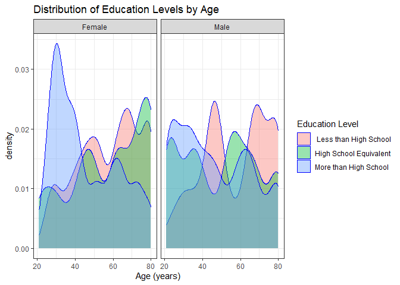
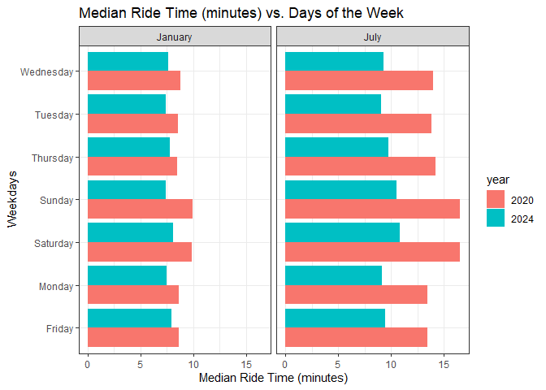
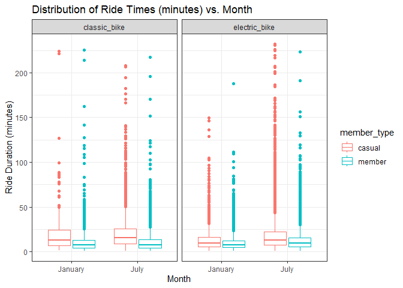

HW3-am6592
================
Adeena Moghni
2024-10-07

## Problem 1

``` r
data("ny_noaa")

mode_prcp =
  ny_noaa %>% 
  count(prcp) %>%
  arrange(desc(n))

mode_snow = 
  ny_noaa %>% 
  count(snow) %>%
  arrange(desc(n))

mode_snwd = 
  ny_noaa %>% 
  count(snwd) %>%
  arrange(desc(n))

mode_tmax = 
  ny_noaa %>% 
  count(tmax) %>%
  arrange(desc(n))

mode_tmin = 
  ny_noaa %>% 
  count(tmin) %>%
  arrange(desc(n))
```

The NOAA dataset is 2595176 rows by 7 columns. The variable names are
id, date, prcp, snow, snwd, tmax, tmin. When taking the counts of each
column value and arranging in descending order to find the most common
values in each column, NA is either the first or second most common
value in each column, indicating missing data is a huge issue for this
data set.

``` r
ny_noaa = 
  ny_noaa %>% 
  separate(date, into = c("year", "month", "day"), convert = TRUE) %>% 
  mutate(
    tmax = as.numeric(tmax),
    tmin = as.numeric(tmin))
```

``` r
snow_rank =
  ny_noaa %>% 
  group_by(snow) %>%
  summarize(counts = n()) %>% 
  arrange(desc(counts)) %>% 
  slice(1:5)

knitr::kable(snow_rank)
```

| snow |  counts |
|-----:|--------:|
|    0 | 2008508 |
|   NA |  381221 |
|   25 |   31022 |
|   13 |   23095 |
|   51 |   18274 |

As seen from the table above, the most common value of snowfall is 0,
meaning it did not snow most days in New York.

``` r
ny_noaa %>% 
  group_by(id, year, month) %>% 
  filter(month %in% c(1, 7)) %>% 
  summarize(mean_tmax = mean(tmax, na.rm = TRUE))%>% 
  ggplot(aes(x = year, y = mean_tmax, group = id)) + 
  geom_point() +
  facet_grid(~month) +
  labs(title = "Mean Temp vs Year for January and July", color = "Education Level")
```

    ## `summarise()` has grouped output by 'id', 'year'. You can override using the
    ## `.groups` argument.


July has much higher temperatures compared to January at all station and
time points. Temperatures also follow the same trends wherein stations’
temps go all up or down around the same year in both months (overall).

``` r
 min_vs_max =
  ny_noaa %>%
  na.omit(ny_noaa) %>% 
  ggplot(aes(x = tmin, y = tmax)) + 
  geom_point()

 snow_dist = 
  ny_noaa %>% 
  filter(snow < 100, snow > 0) %>% 
  ggplot(aes(x = snow, y = as.factor(year))) + 
  geom_boxplot()
 
 min_vs_max + snow_dist
```


\## Problem 2

``` r
demo_df = 
  read_csv(file = "data_imports/nhanes_covar.csv", 
          na = c(".", "NA", ""),
          skip = 4,
          col_types = cols(
    `SEQN` = col_character(),
    `sex` = col_factor(),
    `age` = col_integer(),
    `BMI` = col_double(),
    `education` = col_factor())) %>% 
  janitor::clean_names()

mims_df = 
  read_csv(file = "data_imports/nhanes_accel.csv", 
           na = c(".", "NA", ""),
           col_types = cols (
             `SEQN` = col_character() )) %>% 
  janitor::clean_names()

full_accel_df = left_join(mims_df, demo_df, by = "seqn") %>% 
  filter(age >= 21, !is.na(seqn), !is.na(sex), !is.na(age), !is.na(bmi), !is.na(education)) %>% 
  pivot_longer(
    min1:min1440,
    names_to = "minute", 
    values_to = "MIMS",
    names_prefix = "min") %>%  
  mutate(
    minute = as.double(minute)
  )
```

``` r
education_count =
  full_accel_df %>% 
  distinct(seqn, .keep_all = TRUE) %>% 
  mutate(sex = ifelse(sex == 1, "Male", "Female")) %>% 
  mutate(education = ifelse(education == 1, "Less than High School",
                            ifelse(education == 2, "High School Equivalent", "More than High School"))) %>% 
  group_by(sex, education) %>% 
  summarize(counts = n())%>% 
  pivot_wider(
    names_from = "education", 
    values_from = "counts" ) %>% 
  select(1, 3, 2, 4)
```

    ## `summarise()` has grouped output by 'sex'. You can override using the `.groups`
    ## argument.

``` r
knitr::kable(education_count)
```

| sex    | Less than High School | High School Equivalent | More than High School |
|:-------|----------------------:|-----------------------:|----------------------:|
| Female |                    28 |                     23 |                    59 |
| Male   |                    27 |                     35 |                    56 |

``` r
demo_plot = 
  demo_df %>% 
  filter(age >= 21) %>%
  na.omit(demo_df) %>% 
  mutate(sex = ifelse(sex == 1, "Male", "Female")) %>% 
  mutate(education = ifelse(education == 1, " Less than High School",
                            ifelse(education == 2, "High School Equivalent", "More than High School")))

ggplot(demo_plot, aes(x = age, fill = education)) +
  geom_density(alpha = .4, adjust = .5, color = "blue") +
  facet_grid(~sex) +
  labs(title = "Distribution of Education Levels by Age",
       x = "Age (years)", y = "density",
       fill = "Education Level") +
  theme_bw()
```


The table was done by grouping education and sex columns together and
using the summarize tab to count the number of individuals in each
education level by sex. The education/age visualization is a simple
density plot that highlights which age group had higher
density/individuals in certain education levels, separated by sex. The
number of males and females who have less than a high school equivalent
education are about the same (27 and 28, respectively), as are the
number of men and women who have more than a high school equivalent
education (56 and 59, respectively). However, the number of males who
have a high school equivalent education far outnumber the number of
women who have the same education level (35 and 23 , respectively). In
both sexes, about half the participants have more than a high school
education.

When blocking for age, those with more than a high school equivalent
education tended to skew towards younger women from the ages fo 20 to
40. Those with a high school equivalent and less than high school
equivalent education tended to skew towards older women (aged 60+) but
there was local maxima for both these education levels in middle aged
women (40-60 years old), but not as pronounced compared to in older
women. In men, those with more than a high school equivalent education
also tended to be younger, but this skewness was not as pronounced as
compared to the distribution of women of the same education level. Those
with less than a high school equivalent education skewed to be either
between the ages of 40 to 50 or 60+, while those with a high school
equivalent education skewed to middle aged men (between 50 to 60 years
old)

``` r
activity_plot = 
  full_accel_df %>%
  group_by(seqn, age, sex, education) %>% 
  summarize(total_activity = sum(MIMS)) %>% 
  mutate(sex = ifelse(sex == 1, "Male", "Female")) %>% 
  mutate(education = ifelse(education == 1, " Less than High School",
                            ifelse(education == 2, "High School Equivalent", "More than High School")))
```

    ## `summarise()` has grouped output by 'seqn', 'age', 'sex'. You can override
    ## using the `.groups` argument.

``` r
ggplot(activity_plot, aes(x = age, y = total_activity, color = sex)) +
  geom_point(alpha = .5) +
  geom_smooth(se = FALSE) +
  facet_grid(~education) +
  labs(title = "Total Daily Activity Levels vs. Age",
       x = "Age (years)", y = "Total Daily Activity (*MIMS)",
       color = "Education Level") + 
  theme_bw()
```

    ## `geom_smooth()` using method = 'loess' and formula = 'y ~ x'


This plot was made by summing up the activity of every unique seqn ID
for the 24 hour period we have data for. The data was grouped by seqn
ID, age, sex, and education, and using the summarize () function, the
sum for the MIMS activity was taken. This grouping made it possible to
block by education level and sex in the scatterplot, which was done by
using different color points/lines for females and males and different
facets for education level.

As age increases, males and females of all education levels see a
decrease in activity overall. For those with less than a HS education,
younger females (\<40 years of age) tended to be more active, after 40
years old, males tended to be more active. For those with a HS
equivalent education and more than HS education, females tended to be
more active compared to males. For adults \<~50 years old, those with
more than a HS education tended to be less active, in both males and
females. After this point, however, activity seems to have evened out.

``` r
timecourse_plot = 
  full_accel_df %>%
  mutate (hour = minute / 60) %>% 
  group_by(seqn, sex, education, hour) %>% 
  summarize(MIMS) %>% 
  mutate(sex = ifelse(sex == 1, "Male", "Female")) %>% 
  mutate(education = ifelse(education == 1, " Less than High School",
                            ifelse(education == 2, "High School Equivalent", "More than High School")))
```

    ## `summarise()` has grouped output by 'seqn', 'sex', 'education'. You can
    ## override using the `.groups` argument.

``` r
ggplot(timecourse_plot, aes(x = hour, y = MIMS, color = sex)) +
  geom_point(alpha = 0.01) +
  geom_smooth() +
  facet_grid(~education) + 
  labs(title = "Activity Levels vs. Hour",
       x = "Hour", y = "Activity (*MIMS)",
       color = "Sex") +
  theme_bw()
```

    ## `geom_smooth()` using method = 'gam' and formula = 'y ~ s(x, bs = "cs")'


This plot was created by grouping seqn ID (to ensure no duplicate plot
points), sex, education, and hour (which converted minutes to hours by
dividing minutes by 60). Each MIMS activity was taken for the plot
points in this group using the summarize() function. The scatter plot
plotted activity vs hour. Since there were a lot of data, the plot
points overlapped one another and it became hard to see trends, so a
trend line using geom_smooth was added and the points were made
transparent to see the trend lines better.

Males and females tended to show similar trends, with activity
decreasing from between hour 0 and hour 5 (most likely corresponding to
sleeping hours for most participants), increasing after hour 5 until
plateauing at a maximum at around hours 10-20. After hour 20, activity
starts to decrease again. In all three education levels, women have
slightly higher activity at most hours.

## Problem 3

``` r
jan2020_df = 
  read_csv(file = "data_imports/citibike/Jan_2020_Citi.csv", na = c(".", "NA", "")) %>% 
  mutate("date" = "January 2020")

jan2024_df = 
  read_csv(file = "data_imports/citibike/Jan_2024_Citi.csv", na = c(".", "NA", ""))%>% 
  mutate("date" = "January 2024")

july2020_df = 
  read_csv(file = "data_imports/citibike/July_2020_Citi.csv", na = c(".", "NA", ""))%>% 
  mutate("date" = "July 2020")

july2024_df = 
  read_csv(file = "data_imports/citibike/July_2024_Citi.csv", na = c(".", "NA", ""))%>% 
  mutate("date" = "July 2024")

combined_df = 
  bind_rows(jan2020_df, july2020_df, jan2024_df, july2024_df) %>% 
  rename("member_type" = "member_casual")
```

``` r
ride_count =
  combined_df %>% 
  na.omit(combined_df) %>%
  group_by(date, member_type) %>%
  summarize(counts = n()) %>% 
  pivot_wider(
    names_from = "member_type", 
    values_from = "counts" )
```

    ## `summarise()` has grouped output by 'date'. You can override using the
    ## `.groups` argument.

``` r
knitr::kable(ride_count)
```

| date         | casual | member |
|:-------------|-------:|-------:|
| January 2020 |    980 |  11418 |
| January 2024 |   2094 |  16705 |
| July 2020    |   5625 |  15388 |
| July 2024    |  10843 |  36200 |

Data was grouped by date and member type and the counts of these grouped
points were taken using the summarize() function.

Member ride counts have always been substantially higher than “casual”
riders. July in both years saw an increase in rides from both membership
rides, corresponding to more people biking in the summer/warm weather.
There are a lot more riders in 2024 in both January and July compared to
the same months in 2020. This may be due to less people knowing about
these bikes or less bikes/bike stations available for the public to use.
Additionally, July 2020 still had very high Covid-19 rates, so it could
also indicate people quarantining due to the pandemic.

``` r
july2024_rank =
  july2024_df %>% 
  na.omit(july_df) %>%
  group_by(start_station_name) %>%
  summarize(counts = n()) %>% 
  arrange(desc(counts)) %>% 
  slice(1:5)

knitr::kable(july2024_rank)
```

| start_station_name       | counts |
|:-------------------------|-------:|
| Pier 61 at Chelsea Piers |    163 |
| University Pl & E 14 St  |    155 |
| W 21 St & 6 Ave          |    152 |
| West St & Chambers St    |    150 |
| W 31 St & 7 Ave          |    145 |

Above is the most popular start stations in July 2024.

``` r
median_plot = 
  combined_df %>% 
  na.omit(combined_df) %>%
  separate(date, into = c("month", "year")) %>% 
  group_by(weekdays, month, year) %>% 
  summarize(median_ride = median(duration))
```

    ## `summarise()` has grouped output by 'weekdays', 'month'. You can override using
    ## the `.groups` argument.

``` r
ggplot(median_plot, aes(x = median_ride, y = weekdays, fill = year)) +
  geom_histogram(stat = "identity", position = "dodge") +
  facet_grid(~month) +
  labs(title = "Median Ride Time (minutes) vs. Days of the Week",
       x = "Median Ride Time (minutes)", y = "Weekdays") +
  theme_bw()
```


Median ride times were longer in all days in both January and July in
2020 compared to 2024. This could be due to less stations being
available in 2020 compared to 2024. Additionally, in July, the
difference between 2020 and 2024 median ride times is much more
pronounced compared to January. This could be due to the pandemic and
people avoiding public transport to get around the city.

``` r
ride_dist_plot = 
  combined_df %>% 
  na.omit(combined_df) %>%
  separate(date, into = c("month", "year")) %>% 
  filter(year == 2024) %>% 
  group_by(month, member_type, rideable_type) %>% 
  summarize(duration)
```

    ## `summarise()` has grouped output by 'month', 'member_type', 'rideable_type'.
    ## You can override using the `.groups` argument.

``` r
ggplot(ride_dist_plot, aes(x = month, y = duration, color = member_type)) +
  geom_boxplot() +
  facet_grid(~rideable_type) + 
  labs(title = "Distribution of Ride Times (minutes) vs. Month",
       x = "Month", y = "Ride Duration (minutes)") +
  theme_bw()
```


I chose to show this data as box plots since the task was to show the
distribution of data and not all data points. Moreover, I thought any
trends that could be seen through this data would be much easier to
visualize using box plots.

There are many outliers in all subsets of these data, but the box plots
in general show that the ride times for casual riders is higher than
that of member riders. Casual riders have higher rental rates and fees,
so it may make more sense financially for these riders to have fewer,
longer rides compared to member riders, who can have many, shorter
rides. Moreover, the difference between the distribution of ride times
for class bikes vs. electric bikes in member riders was very small in
both months. In casual riders, however, classic bikes tended to have
longer ride times.
