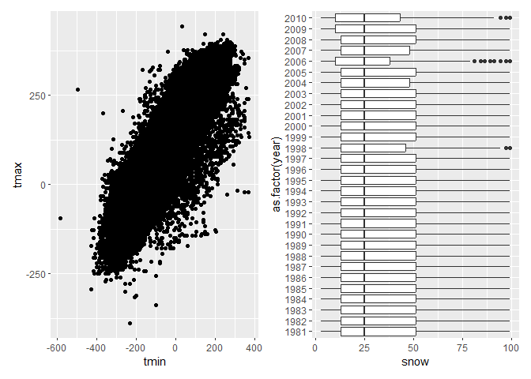

HW3-am6592
================
Adeena Moghni
2024-10-07

## Problem 2

``` r
demo_df = 
  read_csv(file = "data_imports/nhanes_covar.csv", 
          na = c(".", "NA", ""),
          skip = 4,
          col_types = cols(
    `SEQN` = col_character(),
    `sex` = col_factor(),
    `age` = col_integer(),
    `BMI` = col_double(),
    `education` = col_factor())) %>% 
  janitor::clean_names()

mims_df = 
  read_csv(file = "data_imports/nhanes_accel.csv", 
           na = c(".", "NA", ""),
           col_types = cols (
             `SEQN` = col_character() )) %>% 
  janitor::clean_names()

full_accel_df = left_join(mims_df, demo_df, by = "seqn") %>% 
  filter(age > 20, !is.na(seqn), !is.na(sex), !is.na(age), !is.na(bmi), !is.na(education)) %>% 
  pivot_longer(
    min1:min1440,
    names_to = "minute", 
    values_to = "MIMS",
    names_prefix = "min") %>%  
  mutate(
    minute = as.double(minute)
  )
```

``` r
education_count =
  full_accel_df %>% 
  distinct(seqn, .keep_all = TRUE) %>% 
  mutate(sex = ifelse(sex == 1, "Male", "Female")) %>% 
  mutate(education = ifelse(education == 1, "Less than High School",
                            ifelse(education == 2, "High School Equivalent", "More than High School"))) %>% 
  group_by(sex, education) %>% 
  summarize(counts = n())%>% 
  pivot_wider(
    names_from = "education", 
    values_from = "counts" ) %>% 
  select(1, 3, 2, 4)
```

    ## `summarise()` has grouped output by 'sex'. You can override using the `.groups`
    ## argument.

``` r
knitr::kable(education_count)
```

| sex    | Less than High School | High School Equivalent | More than High School |
|:-------|----------------------:|-----------------------:|----------------------:|
| Female |                    28 |                     23 |                    59 |
| Male   |                    27 |                     35 |                    56 |

``` r
demo_plot = 
  demo_df %>% 
  filter(age > 20) %>%
  na.omit(demo_df) %>% 
  mutate(sex = ifelse(sex == 1, "Male", "Female")) %>% 
  mutate(education = ifelse(education == 1, " Less than High School",
                            ifelse(education == 2, "High School Equivalent", "More than High School")))

ggplot(demo_plot, aes(x = age, fill = education)) +
  geom_density(alpha = .4, adjust = .5, color = "blue") +
  facet_grid(~sex) +
  labs(title = "Distribution of Education Levels by Age",
       x = "Age (years)", y = "density",
       fill = "Education Level") +
  theme_bw()
```


The number of males and females who have less than a high school
equivalent education are about the same (27 and 28, respectively), as
are the number of men and women who have more than a high school
equivalent education (56 and 59, respectively). However, the number of
males who have a high school equivalent education far outnumber the
number of women who have the same education level (35 and 23 ,
respectively). In both sexes, about half the participants have more than
a high school education. When blocking for age, those with more than a
high school equivalent education tended to skew towards younger women
from the ages fo 20 to 40. Those with a high school equivalent and less
than high school equivalent education tended to skew towards older women
(aged 60+) but there was local maxima for both these education levels in
middle aged women (40-60 years old), but not as pronounced compared to
in older women. In men, those with more than a high school equivalent
education also tended to be younger, but this skewness was not as
pronounced as compared to the distribution of women of the same
education level. Those with less than a high school equivalent education
skewed to be either between the ages of 40 to 50 or 60+, while those
with a high school equivalent education skewed to middle ages men
(between 50 to 60 years old)

``` r
activity_plot = 
  full_accel_df %>%
  group_by(seqn, age, sex, education) %>% 
  summarize(total_activity = sum(MIMS)) %>% 
  mutate(sex = ifelse(sex == 1, "Male", "Female")) %>% 
  mutate(education = ifelse(education == 1, " Less than High School",
                            ifelse(education == 2, "High School Equivalent", "More than High School")))
```

    ## `summarise()` has grouped output by 'seqn', 'age', 'sex'. You can override
    ## using the `.groups` argument.

``` r
ggplot(activity_plot, aes(x = age, y = total_activity, color = sex)) +
  geom_point(alpha = .5) +
  geom_smooth(se = FALSE) +
  facet_grid(~education) +
  labs(title = "Total Daily Activity Levels vs. Age",
       x = "Age (years)", y = "Total Daily Activity (*MIMS)",
       color = "Education Level") + 
  theme_bw()
```

    ## `geom_smooth()` using method = 'loess' and formula = 'y ~ x'


As age increases, males and females of all education levels see a
decrease in activity overall. For those with less than a HS education,
younger females (\<40 years of age) tended to be more active, after 40
years old, males tended to be more active. For those with a HS
equivalent education and more than HS education, females tended to be
more active compared to men. For adults \<~50 years old, those with more
than a HS education tended to be less active, in both males and females.
After this point, however, activity seems to have evened out.

``` r
timecourse_plot = 
  full_accel_df %>%
  mutate (hour = minute / 60) %>% 
  group_by(sex, education, hour) %>% 
  summarize(MIMS) %>% 
  mutate(sex = ifelse(sex == 1, "Male", "Female")) %>% 
  mutate(education = ifelse(education == 1, " Less than High School",
                            ifelse(education == 2, "High School Equivalent", "More than High School")))
```

    ## Warning: Returning more (or less) than 1 row per `summarise()` group was deprecated in
    ## dplyr 1.1.0.
    ## ℹ Please use `reframe()` instead.
    ## ℹ When switching from `summarise()` to `reframe()`, remember that `reframe()`
    ##   always returns an ungrouped data frame and adjust accordingly.
    ## Call `lifecycle::last_lifecycle_warnings()` to see where this warning was
    ## generated.

    ## `summarise()` has grouped output by 'sex', 'education', 'hour'. You can
    ## override using the `.groups` argument.

``` r
ggplot(timecourse_plot, aes(x = hour, y = MIMS, color = sex)) +
  geom_point(alpha = 0.01) +
  geom_smooth() +
  facet_grid(~education) + 
  labs(title = "Activity Levels vs. Hour",
       x = "Hour", y = "Activity (*MIMS)",
       color = "Sex") +
  theme_bw()
```

    ## `geom_smooth()` using method = 'gam' and formula = 'y ~ s(x, bs = "cs")'



Males and females tended to show similar trends, with activity
decreasing from between hour 0 and hour 5 (most likely corressponding to
sleeping hours for most participants), increasing after hour 5 until
plateauing at a maximum at around hours 10-20. After hour 20, acitivty
starts to decrease again. In all three education levels, women have
slightly higher activity at most hours. \## Problem 3

``` r
jan2020_df = 
  read_csv(file = "data_imports/citibike/Jan_2020_Citi.csv", na = c(".", "NA", "")) %>% 
  mutate("date" = "January 2020")

jan2024_df = 
  read_csv(file = "data_imports/citibike/Jan_2024_Citi.csv", na = c(".", "NA", ""))%>% 
  mutate("date" = "January 2024")

july2020_df = 
  read_csv(file = "data_imports/citibike/July_2020_Citi.csv", na = c(".", "NA", ""))%>% 
  mutate("date" = "July 2020")

july2024_df = 
  read_csv(file = "data_imports/citibike/July_2024_Citi.csv", na = c(".", "NA", ""))%>% 
  mutate("date" = "July 2024")

combined_df = 
  bind_rows(jan2020_df, july2020_df, jan2024_df, july2024_df) %>% 
  rename("member_type" = "member_casual")
```

``` r
ride_count =
  combined_df %>% 
  na.omit(combined_df) %>%
  group_by(date, member_type) %>%
  summarize(counts = n()) %>% 
  pivot_wider(
    names_from = "member_type", 
    values_from = "counts" )
```

    ## `summarise()` has grouped output by 'date'. You can override using the
    ## `.groups` argument.

``` r
knitr::kable(ride_count)
```

| date         | casual | member |
|:-------------|-------:|-------:|
| January 2020 |    980 |  11418 |
| January 2024 |   2094 |  16705 |
| July 2020    |   5625 |  15388 |
| July 2024    |  10843 |  36200 |

``` r
july2024_rank =
  july2024_df %>% 
  na.omit(july_df) %>%
  group_by(start_station_name) %>%
  summarize(counts = n()) %>% 
  arrange(desc(counts)) %>% 
  slice(1:5)

knitr::kable(july2024_rank)
```

| start_station_name       | counts |
|:-------------------------|-------:|
| Pier 61 at Chelsea Piers |    163 |
| University Pl & E 14 St  |    155 |
| W 21 St & 6 Ave          |    152 |
| West St & Chambers St    |    150 |
| W 31 St & 7 Ave          |    145 |

``` r
median_plot = 
  combined_df %>% 
  na.omit(combined_df) %>%
  separate(date, into = c("month", "year")) %>% 
  group_by(weekdays, month, year) %>% 
  summarize(median_ride = median(duration))
```

    ## `summarise()` has grouped output by 'weekdays', 'month'. You can override using
    ## the `.groups` argument.

``` r
ggplot(median_plot, aes(x = median_ride, y = weekdays, fill = year)) +
  geom_histogram(stat = "identity", position = "dodge") +
  facet_grid(~month) +
  labs(title = "Median Ride Time (minutes) vs. Days of the Week",
       x = "Median Ride Time (minutes)", y = "Weekdays") +
  theme_bw()
```

    ## Warning in geom_histogram(stat = "identity", position = "dodge"): Ignoring
    ## unknown parameters: `binwidth`, `bins`, and `pad`


``` r
ride_dist_plot = 
  combined_df %>% 
  na.omit(combined_df) %>%
  separate(date, into = c("month", "year")) %>% 
  filter(year == 2024) %>% 
  group_by(month, member_type, rideable_type) %>% 
  summarize(duration)
```

    ## Warning: Returning more (or less) than 1 row per `summarise()` group was deprecated in
    ## dplyr 1.1.0.
    ## ℹ Please use `reframe()` instead.
    ## ℹ When switching from `summarise()` to `reframe()`, remember that `reframe()`
    ##   always returns an ungrouped data frame and adjust accordingly.
    ## Call `lifecycle::last_lifecycle_warnings()` to see where this warning was
    ## generated.

    ## `summarise()` has grouped output by 'month', 'member_type', 'rideable_type'.
    ## You can override using the `.groups` argument.

``` r
ggplot(ride_dist_plot, aes(x = month, y = duration, color = member_type)) +
  geom_boxplot() +
  facet_grid(~rideable_type) + 
  labs(title = "Distribution of Ride Times (minutes) vs. Month",
       x = "Month", y = "Ride Duration (minutes)") +
  theme_bw()
```


