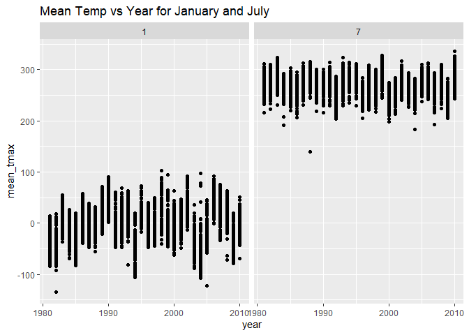

HW3-am6592
================
Adeena Moghni
2024-10-07

## Problem 2

| sex | education | counts |
|:----|:----------|-------:|
| 1   | 1         |     27 |
| 1   | 2         |     34 |
| 1   | 3         |     54 |
| 2   | 1         |     28 |
| 2   | 2         |     23 |
| 2   | 3         |     59 |

<!-- -->

``` r
activity_plot = 
  full_accel_df %>%
  group_by(seqn, age, sex, education) %>% 
  summarize(total_activity = sum(MIMS))
```

    ## `summarise()` has grouped output by 'seqn', 'age', 'sex'. You can override
    ## using the `.groups` argument.

``` r
ggplot(activity_plot, aes(x = age, y = total_activity, color = sex)) +
  geom_point()
```

<!-- -->

## Problem 3
